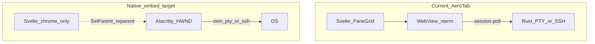

# Native terminal embed POC (experiment branch)

Branch: `experiment/native-terminal-embed`

## Goal

Evaluate whether **Alacritty / Ghostty / Kitty** as child processes can replace or complement **xterm.js in WebView** for fluidity, without abandoning Tauri + Svelte chrome.

## What ships in this POC

| Capability | Status |
|------------|--------|
| Detect `alacritty` / `ghostty` / `kitty` on `PATH` | `nativeTerminal.detect` |
| Spawn **detached** OS window running `argv` (e.g. `ssh user@host`) | `nativeTerminal.spawn` |
| List / close tracked children | `nativeTerminal.list`, `nativeTerminal.close` |
| Context menu + command palette entry | Terminal pane / palette |
| True in-pane embed inside split layout | **Not implemented** (`mode: embed` returns error) |

Detached mode proves subprocess wiring and gives a manual A/B: same SSH profile in AeroTab (xterm) vs native emulator window.

## Why true embed is hard



- **Layout**: Each pane is a DOM cell; a native window is a separate HWND/X11 window. Reparenting one HWND per pane requires per-pane geometry sync on resize, DPI, and maximize — fragile.
- **Features lost or duplicated**: scrollback sync, broadcast input, trzsz bridge, host stats, session-ended overlay, SFTP dock coupling.
- **Platform matrix**: Win32 `SetParent`, X11 `XReparentWindow`, Wayland (often **impossible** for foreign windows), macOS `NSView` hosting — four code paths.
- **Ghostty/Alacritty** do not ship a stable “embed widget” API; integration is window-manager hacks, not supported vendor flows.

## RPC

### `nativeTerminal.detect`

Returns `{ programs: [{ id, path }], embed_supported: false, embed_note }`.

### `nativeTerminal.spawn`

```json
{
  "program": "alacritty",
  "title": "user@host",
  "argv": ["ssh", "-p", "22", "user@host"],
  "mode": "detached"
}
```

`program` omitted → first detected emulator. `mode: "embed"` → error (placeholder).

### `nativeTerminal.list` / `nativeTerminal.close`

Track PIDs started from AeroTab; reaping removes exited processes.

## Next steps if embed is pursued

1. **Phase 1 (done here)**: detached spawn + UX entry points.
2. **Phase 2**: Tauri child `WebviewWindow` per pane is still WebView — does not help Alacritty; only useful for a future Rust/GPU surface.
3. **Phase 3 (platform spike)**: Win32 only — read main window `HWND`, spawn Alacritty, poll `EnumWindows` + `SetParent`, sync `SetWindowPos` to pane rect from frontend (`getBoundingClientRect` → IPC). Single-pane only; document Wayland/macOS gaps.
4. **Decision gate**: If detached alone is enough for power users, keep xterm in-app and optional “Open in Alacritty” — do not merge embed into `main` without benchmark + feature parity checklist.

## Manual test

1. Install one of: `alacritty`, `ghostty`, or `kitty`.
2. Build/run AeroTab desktop.
3. Open SSH pane → context menu → **Open in native terminal (experimental)**.
4. Confirm a separate emulator window runs `ssh` with expected host/port/jump flags.
5. `nativeTerminal.detect` in devtools / RPC should list the binary path.

## Comparison table (to fill after manual runs)

| Scenario | xterm (in-app) | Native detached | Notes |
|----------|----------------|-----------------|-------|
| `cat huge.txt` | | | |
| 5 tabs switch | | | N/A for detached |
| vim + truecolor | | | |
| ProxyJump chain | | | Uses OpenSSH `-J` from UI builder |

See also [`docs/perf-benchmark.md`](perf-benchmark.md) for in-app terminal metrics.
