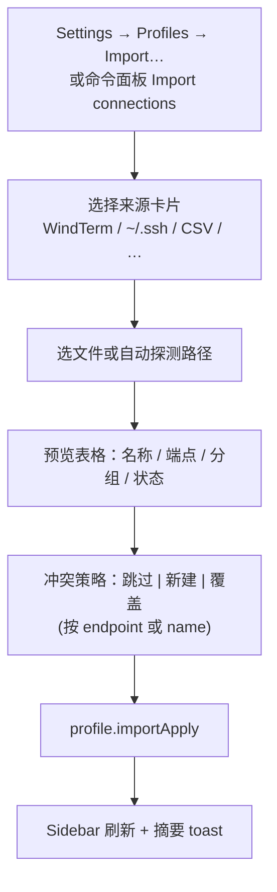

# Connection Import Wizard — Design Spec

**Date:** 2026-06-22  
**Status:** Draft — awaiting user approval  
**Priority:** WindTerm first, then all Termius-class sources in one wizard

## Goal

Add a Termius-style **Import connections** wizard under Settings → Profiles (and command palette entry). Users pick a source, preview rows, resolve duplicates, then bulk-write `ProfileStore` via existing `profile.upsert`.

WindTerm is **P0** (highest priority). All listed sources ship in the same feature area but land in phased PRs.

## Non-goals (v1)

- Import SSH private keys / passphrases from foreign keystore formats (only path references when present)
- PuTTY Pageant protocol
- Automatic periodic re-sync from source apps
- Import port-forward rules / SFTP bookmarks (future `ssh.tunnels` alignment)

## User flow



## Shared data model

### Import candidate (preview row)

```typescript
interface ImportCandidate {
  sourceId: string;           // stable within preview, e.g. windterm uuid
  source: ImportSourceKind;
  name: string;
  group?: string | null;
  tags?: string[];
  note?: string | null;
  kind: 'ssh' | 'rdp' | 'vnc' | 'skip';
  ssh?: { host; port; user; auth; jump_via? };
  remote?: { host; port; kind: 'rdp' | 'vnc' };
  warnings: string[];         // e.g. "password not imported"
  status: 'ready' | 'skip' | 'duplicate' | 'error';
  duplicateOf?: string;       // existing profile id
}
```

### RPC (Rust)

| Method | Purpose |
|--------|---------|
| `profile.importDetect` | `{ source }` → suggested paths / file pick hints |
| `profile.importPreview` | `{ source, path?, content? }` → `{ candidates, stats }` |
| `profile.importApply` | `{ candidates, mode: 'skip'\|'new'\|'overwrite' }` → `{ created, skipped, updated, errors }` |

Parsing runs in `src-tauri/src/import/` on a blocking pool (same pattern as `profile.discover`).

Dedup key default: `ssh:{user}@{host}:{port}` (case-insensitive host/user). Secondary: exact `name` match in same group.

Auth default for imports without secrets: **`Agent`** (system ssh-agent). Key path preserved when source exposes it.

---

## Source: WindTerm (P0)

### Files

| Platform | Typical path |
|----------|----------------|
| Windows | `{install}\profiles\default.v10\terminal\user.sessions` or `%USERPROFILE%\.wind\profiles\default.v10\terminal\user.sessions` |
| Linux | `/opt/WindTerm/profiles/.../user.sessions` or `~/.wind/profiles/default.v10/terminal/user.sessions` |
| macOS | `~/Library/Application Support/WindTerm/...` or app bundle `profiles/` |

Also support **user-picked file** (`.sessions`, `.json`).

Format: JSON **array** of objects with dotted keys (not nested):

```json
{
  "session.group": "Production",
  "session.label": "web-01",
  "session.port": 22,
  "session.protocol": "SSH",
  "session.target": "user@192.168.1.10",
  "session.uuid": "...",
  "ssh.sftp": false
}
```

### Mapping

| WindTerm | AeroTab Profile |
|----------|-----------------|
| `session.label` | `name` |
| `session.group` | `group` (normalize `/` → group path) |
| `session.protocol` | `kind` — `SSH` → ssh; `Telnet`/`Shell` → skip + warning |
| `session.target` | parse `user@host` or bare host → `ssh.user`, `ssh.host` |
| `session.port` | `ssh.port` (default 22) |
| `session.uuid` | `sourceId` only (not stored on profile) |
| `ssh.identityFile` / similar if present | `auth: PublicKey { key_path }` |

### Detect heuristics

1. Scan known paths above for `user.sessions`
2. If multiple profile versions (`default.v10`, `default.v11`), prefer newest readable file
3. UI shows path + session count before preview

---

## Source: ~/.ssh/config (P1)

Reuse `ssh_config::parse` / `load_default`. **Difference from today:** preview offers **Import as Profiles** (persist), not only connect-on-demand.

Map: `Host alias` → name, `HostName`, `User`, `Port`, `IdentityFile`, `ProxyJump` chain via existing jump resolution.

---

## Source: CSV (P1)

Generic columns (auto-detect header):

`name, host, port, username, user, group, tags, protocol, key_path, notes`

Delimiter: comma or semicolon. UTF-8 with BOM ok.

---

## Source: PuTTY (P2)

- Input: `.reg` export or registry hive read (Windows only via optional path picker)
- Parse `HKEY_CURRENT_USER\Software\SimonTatham\PuTTY\Sessions\*`
- Map `HostName`, `PortNumber`, `UserName`, `PublicKeyFile` (convert `.ppk` path → warn if not OpenSSH)

---

## Source: MobaXterm (P2)

- Input: `MobaXterm.ini` or exported sessions section
- Parse `[SessionX]` / `Session` keys (version-dependent)
- Map SSH sessions only in v1

---

## Source: Xshell (P2)

- Input: folder of `.xsh` or single export file
- Parse XML/INI for `Host`, `Port`, `UserName`, `AuthMethod`
- Password fields: skip + warning

---

## Source: SecureCRT (P3)

- Input: XML export from SecureCRT
- XPath-like parse for `session` nodes

---

## Source: Terminus / Tabby (P3)

- Tabby v2: already auto-migrates `org.tabby.v2` on first launch
- Optional: Tabby/Terminus JSON export if user provides file (schema from `profiles.sled` export JSON)

---

## UI: `ImportConnectionsWizard.svelte`

Location: Settings → Profiles → **Import connections…** button; command palette `action.importConnections`.

Layout (Termius-like):

- Grid of source cards with icon + label
- WindTerm card **first** (featured row)
- Step 2: path auto-detect + Browse file
- Step 3: table with checkboxes, filter, duplicate badges
- Footer: count summary + **Import N profiles**

i18n keys under `import.*` (en + zh-CN).

---

## Implementation phases

| Phase | Scope | Deliverable |
|-------|--------|-------------|
| **1** | WindTerm parser + RPC + wizard shell | Usable WindTerm import end-to-end |
| **2** | ~/.ssh/config bulk + CSV | Two more cards in same wizard |
| **3** | PuTTY, MobaXterm, Xshell | Windows-heavy parsers |
| **4** | SecureCRT, Tabby JSON | Remaining cards |

Each phase: `cargo test` parser unit tests + `npm run check` + manual sample file smoke.

---

## Risks

| Risk | Mitigation |
|------|------------|
| WindTerm path varies by install | Detect + always allow file pick |
| `user.sessions` invalid JSON (trailing commas) | Lenient JSON repair or line-by-line object parse |
| Secrets not exported | Clear warnings; default Agent auth |
| Large imports (500+ sessions) | Batch upsert; progress in UI |

---

## Resolved decisions (2026-06-22)

1. **WindTerm v1 scope:** Import all session types; unsupported / unmappable protocols → row `status: error` with clear warning (not silent skip).
2. **Duplicate default:** **Skip** when `user@host:port` matches existing profile (user can override per-row or bulk in preview).
3. **Source tags:** Auto-add tag `import:windterm`, `import:putty`, etc. for filtering in Sidebar.

## Open questions for user

~~1. WindTerm: import SSH only...~~  
~~2. Duplicate policy...~~  
~~3. Should imported profiles get tag...~~

_All resolved — ready for implementation plan._
