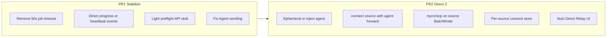

# SFTP Direct (Agent-forward) — Implementation Plan

## Locked decisions (grilling)

- Direct = source-exec `rsync`/`scp` + **local/ephemeral agent forward** (no `/tmp` key on source)
- Dest auth for Direct: agent keys + keys AeroTab injects from PublicKey/Vault; password → Relay
- Modes: Auto / Direct / Relay (default Auto)
- Surfaces: Transfer center + dock→center only (modal cross-session deferred)
- Long-running Direct with cancel + progress/heartbeat (remove ~50s whole-job UI timeout)
- Light preflight; first-time per-source agent-forward consent (rememberable)
- Defects in scope: D1–D4, D6 (not modal unification D5)
- Delivery: **PR1** (no version bump) → **PR2** bump **0.2.18**

## Current code anchors

- Direct impl (key upload to source): [`src-tauri/src/remote_transfer.rs`](../../src-tauri/src/remote_transfer.rs) `run_direct_transfer`
- RPC: [`src-tauri/src/commands.rs`](../../src-tauri/src/commands.rs) `sftp.directTransfer` / `sftp.relayTransfer` / cancel
- Agent forward hook: `connect_authenticated_with_agent_forwarding` in [`src-tauri/src/ssh/mod.rs`](../../src-tauri/src/ssh/mod.rs)
- UI timeout bug: [`FileTransferWindow.svelte`](../../apps/ui/src/components/FileTransferWindow.svelte) `TRANSFER_RPC_TIMEOUT_MS = 45_000` + `tryDirectRemoteTransfer`
- Dock route: [`App.svelte`](../../apps/ui/src/App.svelte) `routeCrossTransferToCenter`
- Misleading i18n: `transfer.modeDirectAgent` / `transfer.directRunning`

---

## PR1 — Stabilize transfer center (no version bump)

**Goal:** Large Direct/relay jobs survive; users see truthful status; preflight hooks ready without full agent rewrite.

1. **Timeout model**
   - Stop wrapping entire `sftp.directTransfer` in 45–50s `withTransferTimeout`.
   - Align with relay: stall/heartbeat cancel, not wall-clock whole-file timeout.
   - Keep short timeouts only for setup RPCs (`stat`, preflight).

2. **Progress / heartbeat for Direct**
   - Backend events (mirror relay): `transfer:direct-progress` and/or `transfer:direct-heartbeat` with `transfer_id`.
   - MVP: periodic heartbeat while exec channel open; optional: parse `rsync --progress`.
   - `FileTransferWindow` listens and updates task row; cancel via `sftp.cancelDirectTransfer` (same pattern as `relay_cancel`).

3. **Light preflight RPC**
   - `sftp.directPreflight` returning structured reasons: missing profiles, unsupported dest auth, no `rsync`/`scp` on source, agent forward not consented.
   - UI: before Auto/Direct, call preflight; if Direct impossible and mode is Auto → skip to relay with message; if mode is Direct → fail with reason.

4. **Copy / defects**
   - Rewrite i18n away from false “SSH Agent 直传” toward accurate Direct wording (PR2 can refine to Agent-forward).
   - D3: `receiveRemoteDrop` silent return → user-visible error.
   - D4: source/dest session closed mid-transfer → cancel/error surfaced.
   - D6: Direct requires `sftp_profiles`; clear error if missing (`openForSession` path).

5. **Validation:** `cargo fmt`, clippy desktop, `npm run check`; manual: long Direct must not flip to relay at ~50s while still running.

---

## PR2 — Agent-forward Direct C + 0.2.18

**Goal:** No private key file on source; dest auth via forwarded agent; consent UX; bump version.

1. **Ephemeral / inject agent (local)**
   - Dest PublicKey / Vault key material → load into process-local or carefully scoped OS agent on AeroTab host; never `cat` to source `/tmp`.
   - Dest already `AuthMethod::Agent` → use existing identities.
   - Password / unsupported → preflight marks Direct unavailable.

2. **Source connection with agent forward**
   - Replace key-upload path in `run_direct_transfer` with agent-forwarding connect on **source**.
   - Exec `rsync`/`scp` with `BatchMode=yes`, no remote `-i` key path.
   - Tear down forward + remove ephemeral identities after transfer.

3. **Consent store**
   - Persist “always allow agent forward for source host”.
   - First Direct needing forward for that source → confirm; decline → Relay if Auto, else fail.

4. **Transfer center modes**
   - Auto / Direct / Relay match behavior; default Auto.
   - Messages distinguish Direct vs Relay vs fallback reason.

5. **Version**
   - Bump **0.2.18** in `Cargo.toml`, `tauri.conf.json`, `apps/ui/package.json`, `Cargo.lock` workspace entry; optional `buildId`.

6. **Validation:** PublicKey dest Direct without source `/tmp` key; password dest → Relay; consent remembered; cancel mid-Direct; Windows smoke if releasing NSIS.

---

## Out of scope

- Modal SFTP cross-session → transfer center (D5)
- Password-based Direct (`sshpass`)
- Reusing interactive shell for SFTP (`terminalSessionId`)
- Dock keep-alive redesign (done in 0.2.16)

## Glossary

See [`CONTEXT.md`](../../../CONTEXT.md).
